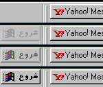

## Fading Start Menu Button

### Description

This program makes the start button *FADE IN* when you move the mouse over its location and *FADE OUT* when it losts mouse focus. See the screen shot. It gives a different shell to your windows. By the way, I'll appreciate your vote.
 
### More Info
 
No side Effects, but Before "END TASK"ing this program, you must move the mouse over start button to make it fade in, and the press ALT+CTRL+DEL, or the start button will stay hidden until the next startup of Windows or this program.

             |
---                |---
**Submitted On**   |2001-07-25 08:08:44
**By**             |[Hesan Feghhi](https://github.com/Planet-Source-Code/PSCIndex/blob/master/ByAuthor/hesan-feghhi.md)
**Level**          |Intermediate
**User Rating**    |5.0 (10 globes from 2 users)
**Compatibility**  |VB 5\.0, VB 6\.0
**Category**       |[Windows System Services](https://github.com/Planet-Source-Code/PSCIndex/blob/master/ByCategory/windows-system-services__1-35.md)
**World**          |[Visual Basic](https://github.com/Planet-Source-Code/PSCIndex/blob/master/ByWorld/visual-basic.md)
**Archive File**   |[Fading Sta235247262001\.zip](https://github.com/Planet-Source-Code/hesan-feghhi-fading-start-menu-button__1-25463/archive/master.zip)

